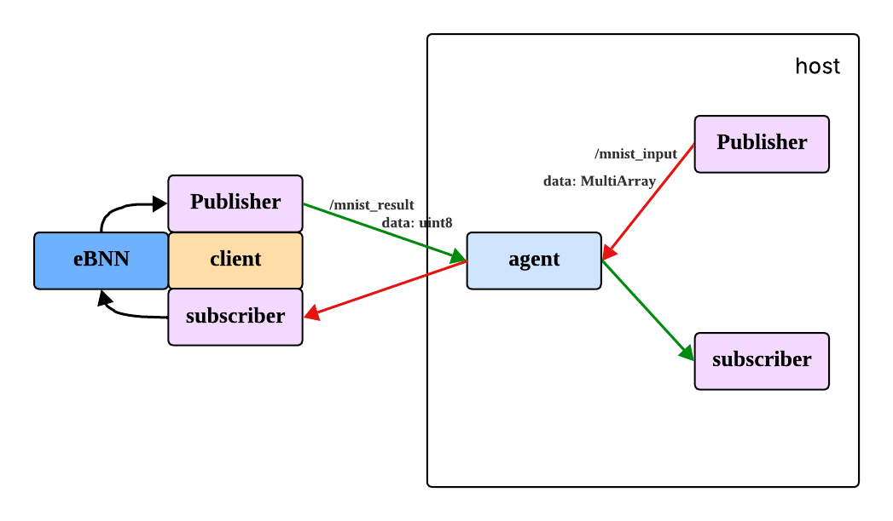

# eBNN on NodeMCU with micro-ROS
This repository contains a simple project implementing embedded neural network inference on ESP32 platforms using micro-ROS integration.
## System Architecture

## Project Structure
```text
eBNN-microROS
├── README.md
├── include
│   ├── ebnn.h
│   └── simple_mnist.h
├── platformio.ini
└── src
    ├── client
    │   └── main.cpp
    └── host
        ├── agent
        │   └── run_agent.sh
        ├── publisher
        │   ├── Dockerfile
        │   ├── mnist_publisher
        │   │   ├── mnist_publisher
        │   │   │   ├── __init__.py
        │   │   │   └── mnist_publisher.py
        │   │   ├── package.xml
        │   │   ├── resource
        │   │   │   └── mnist_publisher
        │   │   ├── setup.cfg
        │   │   └── setup.py
        │   └── run_publisher.sh
        └── subscriber
            ├── Dockerfile
            ├── mnist_subscriber
            │   ├── mnist_subscriber
            │   │   ├── __init__.py
            │   │   └── mnist_subscriber.py
            │   ├── package.xml
            │   ├── resource
            │   │   └── mnist_subscriber
            │   ├── setup.cfg
            │   └── setup.py
            └── run_subscriber.sh

```
## Prerequisites
### Hardware Requirements
|Item|Quantity|Notes|
|---|---|---|
|ESP32 board (NodeMCU-32S)|1|
|USB cables|1|One end must be micro-B|
|Development machine|1|Ubuntu 22.04 LTS recommended|
### Software Requirements
|Components|Purpose|
|---|---|
|VScode with PlatformIO extension|IDE|
|Docker|Start publisher and subscriber services|

## Quick Start Guide
1. Clone the repo and open it with VScode (PlatformIO extension required).

    ```bash
    git clone https://github.com/Steven0811/eBNN-microROS.git
    cd eBNN-microROS
    ```
2. Wait until PlatformIO successfully initializing the project.
3. Connect ESP32 and your development machine with USB cable.
4. Run and upload the code to ESP32.
    ```bash
    # in PlatformIO CLI
    pio run -t upload --upload-port <your ESP32 port>
    ```
5. Start agent
    ```bash
    # Terminal 1: Flash firmware and start agent
    cd eBNN-microROS/src/host/agent
    bash run_agent.sh
    ```
6. Start subscriber
    ```bash
    # Terminal 2: Run subscriber
    cd eBNN-microROS/src/host/subscriber
    bash run_subscriber.sh
    ```
7. Start publisher
    ```bash
    # Terminal 3: Run publisher
    cd eBNN-microROS/src/host/publisher
    bash run_publisher.sh
    ```
## License
This project is licensed under the MIT License.

This project uses third-party components:
- eBNN (MIT)
- micro_ros_platformio (Apache-2.0)
## Reference
- eBNN: https://github.com/kunglab/ebnn
- micro_ros_platformio: https://github.com/micro-ROS/micro_ros_platformio
- micro-ROS: https://micro.ros.org/
- ROS2: https://docs.ros.org/
- PlatfromIO: https://platformio.org/
